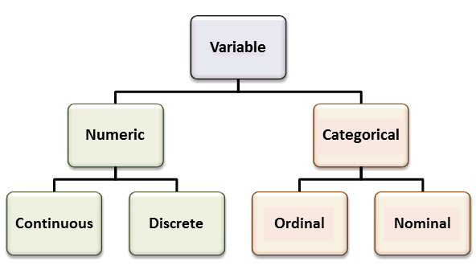

# Basic data structures in R {#intro}

Before we jump into actual data analysis, it is desirable to first think about what are common variable types and how they are stored in R.  

A *variable* is any characteristics, number, or quantity that can be measured or counted. A variable may also be called a *data item*. Age, sex, business income and expenses, country of birth, capital expenditure, class grades, eye colour and vehicle type are examples of variables. It is called a variable because the value may vary between data units in a population, and may change in value over time.(Australian Bureau of Statistics, ABS)


## Types of variables: A taxonomy

### Categorical variables: ordinal vs. norminal

Categorical variables have values that describe a 'quality' or 'type' or 'category'.Therefore, categorical variables are *qualitative variables* and tend to be represented by a non-numeric value. Categorical variables should be exclusive (in one category or in another) and exhaustive (include all possible options). 

Categorical variables may be further divided as being ordinal or nominal:

An *ordinal variable* can be logically ordered or ranked. The categories associated with ordinal variables can be ranked higher or lower than another, but do not necessarily establish a numeric difference between each category.In other words, the interval between levels of the variables are unknown. Examples of ordinal categorical variables include academic grades (i.e. A, B, C), clothing size (i.e. small, medium, large, extra large) and attitudes (i.e. strongly agree, agree, disagree, strongly disagree).

> For example, when doing a survey, participants will be asked to rate. The subjective measurements of this kind are often ordinal variables. E.g. a Likert ranking scale; level of education (“< high school”, “high school”, “associate’s degree”). 

We can assign numbers to different levels of an ordinal variable, but we should bear in mind that these variable are not numeric. For example, “strongly agree” and “neutral” cannot average out to an “agree”, even though you may assign 5 to "strong agree" and 3 to "neutral".

A *nominal variable* is not able to be organised in a logical sequence. Examples of nominal categorical variables include sex, business type, eye colour, religion and brand.

The data collected for a categorical variable are *qualitative data*.

### Numeric variables: discrete or continuous

*Numeric variables* have values that describe a measurable quantity as a number, like 'how many' or 'how much'. Therefore, numeric variables are *quantitative variables*.(ABS) It is also called **Interval/ratio variables** and the interval between numbers is equal:  the interval between 1 kg and 2 kg is the same as between 3 kg and 4 kg.

Numeric variables may be further divided as being either continuous or discrete:

A *discrete variable* consists of counts from a set of distinct whole values. A discrete variable cannot take the value of a fraction between one value and the next closest value. Examples of discrete variables include the number of registered cars, number of business locations, and number of children in a family, all of of which measured as whole units (i.e. 1, 2, 3 cars).(ABS)

A *continuous variable * can take any value between a certain set of real numbers. The value given to an observation for a continuous variable can include values as small as the instrument of measurement allows. Examples of continuous variables include height, time, age, and temperature.(ABS)

The data collected for a numeric variable are *quantitative data*.

The variable type will determine (1) statistical analysis; (2) the way we summarize data with statistics and plots. 
```{r variable_type, fig.cap='Taxonomy of variables', out.width='100%', fig.asp=.75, fig.align='center', echo=FALSE}



```

Variables can be stored in R in different data types. 

- Normial and ordinal variables can be stored as *character* or *factors* (with levels).

- Interval data are stored as numbers either as *integer* or *numeric* (real or decimal). 

If you have only one variable, you can store it in a vector. However, more often than not, you have a bunch of variables that need to be stored or imported as a matrix or data frame.

## 1D data structure: vectors

A vector is a sequence of data elements of the same basic type: integer, double, logical or character. All elements of a vector must be the same type.

### Creating vectors

```{r}
a = 8:17

b <- c(9, 10, 100, 38)

c = c (TRUE, FALSE, TRUE, FALSE)

c = c (T, F, T, F)

d = c ("TRUE", "FALSE", "FALSE")

# You can change the type of a vector with as.vector function.

as.vector(b, mode = "character")

# When you put elements of different types in one vector, R will automatically change the type of some elements to keep the whole vector homogenous.

e = c(9,10, "ab", "cd")

f = c(10, 11, T, F)

```
c () is a function in R.


There are some other basic functions in R that you can play with to generate vectors.

```{r}

A = 9:20 + 1

B = seq (1, 10)

C = seq (1, 20, by= 2)

D = rep (5, 4)

E = rep (c(1,2,3), 4)

G = rep (c(1,2,3), each = 4)

# Now that you have a vector, you can do some Maths.

max(a)

min(a)

range(a)

sum(a)

mean(a)

median(a)

quantile(a)

sd(a)

round(sd(a), 2)

```

### Creating list objects

We can put vectors of different types (e.g., number, logic or character) and lengths in a list object.

```{r}

list1 = list(a, b, c, d, e, f)

list1

# More often than not, we do not make list ourselves but have to deal with lists when we get outputs from stats models.

```


## 2D data structures: matrice and data frames

Most of us have had some experience with the Excel spreadsheet. Data in a spreadsheet are arranged by rows and columns in a rectangular space. This is a typical 2 dimensional data structure. In R, we can have two ways of forming tabular data like a spreadsheet: the matrix and dataframe.

**A matrix **is a collection of data elements arranged in a two-dimensional rectangular layout in which all the elements must be of the same type (e.g., numeric or character). 

**Dataframe** is similar to matrix in shape but only differs in that different types of data (e.g. numeric, factor, character) can co-exist in different columns. Thus, in data analysis, we use dataframes more often than matrix.


```{r}
# Let's generate a dataframe from scratch.

id = seq(1, 40)

gender = rep(c("male", "female"), 5)

maths = rnorm(40, mean = 70, sd = 5)

english = rnorm(40, mean = 80, sd = 9)

music = rnorm(40, mean = 75, sd = 10)

pe = rnorm(40, mean = 86, sd = 12)

df1 = data.frame (id, gender, maths, english)


```

Now let's explore the data frame we just created.

```{r}

str(df1)

summary(df1)

nrow(df1)

ncol(df1)

attributes(df1)


```

### what if I want to change column names or add variable to the df?

```{r}

df2 = data.frame (id = id, gender = gender, maths = maths, english = english)

df2 = cbind(df2, pe)

colnames(df2) = c("ID", "SEX","MATHS","ENGLISH","PE")

head(df2)

```


### Subsetting dataframes

We all know how to select part of an Excel spreadsheet by clicking and moving our mouse. In R, when we want to select part of a dataframe, we use this formula, **dataframe[row, column]**.

There are various ways we can use this formula and believe it or not, you will love them!


```{r}

# the complete dataset

df2

df2[2:5, ] # from row 2 to row 5

df2[ , 1:2] # select column 1 to 2

df2[ , c("ENGLISH", "PE")] # select by column names

df2[c(1,2,3), ] #select the first three rows

df2[seq(1, 40, 2), ] #select every other rows from 1 to 40 rows 

```
## Summary

| Dimensions | Homogenous | Heterogeneous |
|-----------:|:----------:|:--------------|
| 1D | Atomic Vector | List |
| 2D | Matrix| Data frame |
| nD | Array |   |

