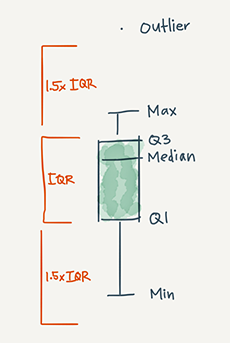
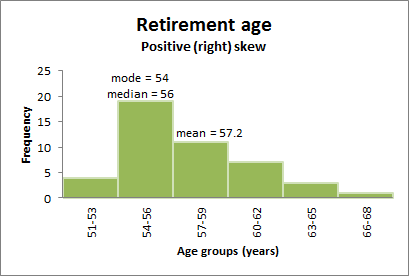

# Variation

Variation is the tendency of the values of a variable to change from measurement to measurement. (Wickham & Grolemund)


## Categorical variable

The best way to characterizing categorical variables is via the frequency. The *frequency* is the number of times a particular value for a variable (data item) has been observed to occur.

*How can we measure frequency?*

The frequency of a value can be expressed in different ways, depending on the purpose required.

The *absolute frequency* describes the number of times a particular value for a variable (data item) has been observed to occur. Or simply put, counts.

A *relative frequency* describes the number of times a particular value for a variable (data item) has been observed to occur in relation to the total number of values for that variable.It is calculated by dividing the absolute frequency by the total number of values for the variable.

Ratios, rates, proportions and percentages are different ways of expressing relative frequencies.


 - A *ratio*compares the frequency of one value for a variable with another value for the variable. The first value identified in a ratio must be to the left of the colon (:) and the second value must be to the right of the colon (1st value : 2nd value).

> For example, in a total of 20 coin tosses where there are 12 heads and 8 tails, the ratio of heads to tails is 12:8. Alternatively, the ratio of tails to heads is 8:12.

 - A *rate* is a measurement of one value for a variable in relation to another measured quantity.

For example, in a total of 20 coin tosses where there are 12 heads and 8 tails, the rate is 12 heads per 20 coin tosses. Alternatively, the rate is 8 tails per 20 coin tosses.

 - A *proportion* describes the share of one value for a variable in relation to a whole.It is calculated by dividing the number of times a particular value for a variable has been observed, by the total number of values in the population.

> For example, in a total of 20 coin tosses where there are 12 heads and 8 tails, the proportion of heads is 0.6 (12 divided by 20). Alternatively, the proportion of tails is 0.4 (8 divided by 20).


 - A *percentage* expresses a value for a variable in relation to a whole population as a fraction of one hundred. The percentage total of an entire dataset should always add up to 100, as 100% represents the total, it is equal to the ‘whole’. A percentage is calculated by dividing the number of times a particular value for a variable has been observed, by the total number of observations in the population, then multiplying this number by 100.

For example, in a total of 20 coin tosses where there are 12 heads and 8 tails, the percentage of heads is 60% (12 divided by 20, multiplied by 100). Alternatively, the percentage of tails is 40% (8 divided by 20, multiplied by 100). (ABS)

*Frequency distributions* are visual displays that organise and present frequency counts so that the information can be interpreted more easily.

How do we show a frequency distribution?

A frequency distribution of data can be shown in a table or graph. Some common methods of showing frequency distributions include *frequency tables*, *bar charts* or *histograms*.


Frequency Tables

A frequency table is a simple way to display the number of occurrences of a particular value or characteristic.

```{r }
library(tidyverse)
summary(diamonds)

str(diamonds)

library(Hmisc)

describe(diamonds)

contents(diamonds)

```

Categorical variables are usually stored as factors or characters. You can use count() function or bar chart to explore the distribution.

A bar chart is a type of graph in which each column (plotted either vertically or horizontally) represents a categorical variable or a discrete ungrouped numeric variable. It is used to compare the frequency (count) for a category or characteristic with another category or characteristic.(ABS)

How to interprate:

- In a bar chart, the bar height (if vertical) or length (if horizontal) shows the frequency for each category or characteristic.

- The distribution of the dataset is not important because the columns each represent an individual category or characteristic rather than intervals for a continuous measurement. Therefore, gaps are included between each bar and each bar can be arranged in any order without affecting the data.

```{r}
count(diamonds, cut)

count(diamonds, color)

ggplot(diamonds)+
  geom_bar(aes(x = cut))


ggplot(diamonds)+
  geom_bar(aes(x = color))
```
Try this with clarity!

```{r}
library(languageR)
summary(lexdec)
summary(iris)

```

## Continous variable
A continuous variable can take any of an infinite set of ordered values. You can use a histogram and other descriptive stats to characterize its distribution.

A histogram is a type of graph in which each column represents a numeric variable, in particular that which is continuous and/or grouped.It shows the distribution of all observations in a quantitative dataset. It is useful for describing the shape, centre and spread to better understand the distribution of the dataset.

How to interprate:

 - The height of the column shows the frequency for a specific range of values.
 
 - Columns are usually of equal width, however a histogram may show data using unequal ranges (intervals) and therefore have columns of unequal width.
 
 - The values represented by each column must be mutually exclusive and exhaustive. Therefore, there are no spaces between columns and each observation can only ever belong in one column.
 
 - It is important that there is no ambiguity in the labelling of the intervals on the x-axis for continuous or grouped data (e.g. 0 to less than 10, 10 to less than 20, 20 to less than 30).

```{r}
# histogram
ggplot(diamonds)+
  geom_histogram(aes(carat), binwidth = 0.1)

# histogram zoom in y axsis
ggplot(diamonds)+
  geom_histogram(aes(carat), binwidth = 0.1)+
  coord_cartesian(ylim = c(0,50))

# histogram zoom in x axsis
ggplot(diamonds[ which(diamonds$carat < 3), ])+
  geom_histogram(aes(carat), binwidth = 0.1)

diamonds%>%
  filter(carat <3)%>%
  ggplot()+
  geom_histogram(aes(carat), binwidth = 0.1)

# density plot
ggplot(diamonds,aes(carat))+
  geom_density(kernel = "gaussian")

# area
ggplot(diamonds,aes(carat))+
  geom_area(stat = "bin")

# dotplot
ggplot(diamonds,aes(carat))+
  geom_dotplot()

# freqpoly
ggplot(diamonds, aes(carat))+
  geom_freqpoly()


```

### Five-number summary
The five-number summary is a set of descriptive statistics that provide information about a dataset. It consists of the five most important sample percentiles:

- the sample minimum (smallest observation)

- the lower quartile or first quartile

- the median (the middle value)

- the upper quartile or third quartile

- the sample maximum (largest observation)

The five-number summary provides a concise summary of the distribution of the observations. Reporting five numbers avoids the need to decide on the most appropriate summary statistic. The five-number summary gives information about the location (from the median), spread (from the quartiles) and range (from the sample minimum and maximum) of the observations. Since it reports order statistics (rather than, say, the mean) the five-number summary is appropriate for *ordinal measurements*, as well as *interval and ratio measurements*. (from wikipedia)

How to Find a Five-Number Summary: 

- Step 1: Put your numbers in ascending order (from smallest to largest). For this particular data set, the order is:
> Example: 1,2,5,6,7,9,12,15,18,19,27.

- Step 2: Find the minimum and maximum for your data set. Now that your numbers are in order, this should be easy to spot.
In the example in step 1, the minimum (the smallest number) is 1 and the maximum (the largest number) is 27.

- Step 3: Find the median. The median is the middle number. If you aren’t sure how to find the median, see: How to find the mean mode and median.

- Step 4: Place parentheses around the numbers above and below the median.(This is not technically necessary, but it makes Q1 and Q3 easier to find).
(1,2,5,6,7),9,(12,15,18,19,27).

- Step 5: Find Q1 and Q3. Q1 can be thought of as a median in the lower half of the data, and Q3 can be thought of as a median for the upper half of data.
(1,2,5,6,7),  9, ( 12,15,18,19,27).

-Step 6: Write down your summary found in the above steps.
minimum=1,  Q1 =5, median=9,  Q3=18, and maximum=27.

```{r}

summary(diamonds$carat)

```


### Boxplot & violin plot

It is possible to quickly compare several sets of observations by comparing their five-number summaries, which can be represented graphically using a boxplot.


In descriptive statistics, a **boxplot** is a method for graphically depicting groups of numerical data through their quartiles. 

Boxplots may also have lines extending vertically from the boxes (whiskers) indicating variability outside the upper and lower quartiles, hence the terms box-and-whisker plot and box-and-whisker diagram. 

Outliers may be plotted as individual points. 

The spacings between the different parts of the box indicate the degree of dispersion (spread) and skewness in the data, and show outliers. 

Box plots can be drawn either horizontally or vertically. Box plots received their name from the box in the middle.

box plots typically graph six data points:

- The lowest value, excluding outliers

- The first quartile (this is the 25th percentile, or median of all the numbers below the median)

- The median value (equivalent to the 50th percentile)

- The third quartile (this is the 75th percentile, or median of all the numbers above the median)

- The highest value, excluding outliers

- Outliers

```{r figure3, fig.cap='Boxplot', out.width='100%', fig.asp=.75, fig.align='center'}



#source:https://mode.com/blog/how-to-make-box-and-whisker-plot-sql
```

```{r}
# r base function
boxplot(diamonds$carat)

#ggplot version
ggplot(diamonds, aes(x="carat", y=carat))+
  geom_boxplot()


```

A *violin plot* is a method of plotting numeric data. It is similar to a boxplot, with the addition of a *rotated kernel density* plot on each side.

Violin plots are similar to boxplots. Typically a violin plot will include all the data that is in a box plot: a marker for the median of the data; a box or marker indicating the interquartile range; and possibly all sample points, if the number of samples is not too high.

```{r figure4, fig.cap='Violin plot', out.width='100%', fig.asp=.75, fig.align='center'}

knitr::include_graphics("img/violinplot.png")

#source:https://mode.com/blog/violin-plot-examples
```


So a violin plot is more informative than a plain box plot. While a box plot only shows summary statistics such as mean/median and interquartile ranges, the violin plot shows the full distribution of the data. The difference is particularly useful when the data distribution is multimodal (more than one peak). In this case a violin plot shows the presence of different peaks, their position and relative amplitude.

```{r}
#violin plot
ggplot(diamonds, aes(x="carat", y=carat))+
  geom_violin()

ggplot(diamonds, aes(x="price", y=price))+
  geom_violin()
```

### QQ Plots 
QQ Plots (Quantile-Quantile plots) are plots of two quantiles against each other. A quantile is a fraction where certain values fall below that quantile. For example, the median is a quantile where 50% of the data fall below that point and 50% lie above it. The purpose of QQ plots is to find out *if two sets of data come from the same distribution*. 

A 45 degree angle is plotted on the Q Q plot; if the two data sets come from a common distribution, the points will fall on that reference line.(from Wikipedia)


```{r}
# Solution 1
qplot(sample = carat, data = diamonds)

# solution 2
ggplot(diamonds)+
  geom_qq(aes(sample = carat))+
  geom_qq_line(aes(sample = carat))


```
### The measures of central tendency? (ABS)

A measure of central tendency (also referred to as measures of centre or central location) is a summary measure that attempts to describe a whole set of data with a single value that represents the middle or centre of its distribution.

There are three main measures of central tendency: the mode, the median and the mean. Each of these measures describes a different indication of the typical or central value in the distribution.

- The *mode* is the most commonly occurring value in a distribution.

Consider this dataset showing the retirement age of 11 people, in whole years:

54, 54, 54, 55, 56, 57, 57, 58, 58, 60, 60

*Advantage of the mode:*

The mode has an advantage over the median and the mean as it can be found for both numerical and categorical (non-numerical) data.


*Limitations of the mode:*

In some distributions, the mode may not reflect the centre of the distribution very well. 

>it is easy to see that the centre of the distribution is 57 years, but the mode is lower, at 54 years.
54, 54, 54, 55, 56, 57, 57, 58, 58, 60, 60

more than one mode for the same distribution of data, (bi-modal, or multi-modal). The presence of more than one mode can limit the ability of the mode in describing the centre or typical value of the distribution because a single value to describe the centre cannot be identified.

In some cases, particularly where the data are continuous, the distribution may have no mode at all (i.e. if all values are different).In cases such as these, it may be better to consider using the median or mean, or group the data in to appropriate intervals, and find the modal class.

 - The median is the middle value in distribution when the values are arranged in ascending or descending order.

The median divides the distribution in half (there are 50% of observations on either side of the median value). In a distribution with an odd number of observations, the median value is the middle value.

54, 54, 54, 55, 56, **57**, 57, 58, 58, 60, 60

When the distribution has an even number of observations, the median value is the mean of the two middle values. In the following distribution, the two middle values are 56 and 57, therefore the median equals 56.5 years:

52, 54, 54, 54, 55, 56, 57, 57, 58, 58, 60, 60


*Advantage of the median:*

The median is less affected by outliers and skewed data than the mean, and is usually the preferred measure of central tendency when the distribution is not symmetrical.


*Limitation of the median:*

The median cannot be identified for categorical nominal data, as it cannot be logically ordered.


 - The mean is the sum of the value of each observation in a dataset divided by the number of observations. This is also known as the arithmetic average.

Looking at the retirement age distribution again:

54, 54, 54, 55, 56, 57, 57, 58, 58, 60, 60

The mean is 56.6 years.


Advantage of the mean:

The mean can be used for both continuous and discrete numeric data.


Limitations of the mean:

The mean cannot be calculated for categorical data, as the values cannot be summed.

As the mean includes every value in the distribution the mean is influenced by outliers and skewed distributions.


What else do I need to know about the mean?

The population mean is indicated by the Greek symbol µ (pronounced ‘mu’). When the mean is calculated on a distribution from a sample it is indicated by the symbol x̅ (pronounced X-bar).

### How does the shape of a distribution influence the Measures of Central Tendency?


#### Symmetrical distributions:

When a distribution is symmetrical, the mode, median and mean are all in the middle of the distribution. The following graph shows a larger retirement age dataset with a distribution which is symmetrical. The mode, median and mean all equal 58 years.


```{r}

hist(rbeta(10000,5,2))

hist(rbeta(10000,2,5))

hist(rbeta(10000,5,5))

```

```{r distribution, fig.cap='distribution', out.width='100%', fig.asp=.75, fig.align='center'}

knitr::include_graphics("img/normal.jpg")
knitr::include_graphics("img/right.jpg")


#source:https://mode.com/blog/violin-plot-examples
```


#### Skewed distributions:

When a distribution is skewed the mode remains the most commonly occurring value, the median remains the middle value in the distribution, but the mean is generally ‘pulled’ in the direction of the tails. In a skewed distribution, the median is often a preferred measure of central tendency, as the mean is not usually in the middle of the distribution.

A distribution is said to be positively or right skewed when the tail on the right side of the distribution is longer than the left side. In a positively skewed distribution it is common for the mean to be ‘pulled’ toward the right tail of the distribution. Although there are exceptions to this rule, generally, most of the values, including the median value, tend to be less than the mean value.

The following graph shows a larger retirement age data set with a distribution which is right skewed. The data has been grouped into classes, as the variable being measured (retirement age) is continuous. The mode is 54 years, the modal class is 54-56 years, the median is 56 years and the mean is 57.2 years.


A distribution is said to be negatively or left skewed when the tail on the left side of the distribution is longer than the right side. In a negatively skewed distribution, it is common for the mean to be ‘pulled’ toward the left tail of the distribution. Although there are exceptions to this rule, generally, most of the values, including the median value, tend to be greater than the mean value.

The following graph shows a larger retirement age dataset with a distribution which left skewed. The mode is 65 years, the modal class is 63-65 years, the median is 63 years and the mean is 61.8 years.
### Unusual values
```{r}
unusual = diamonds %>%
  filter(y < 3 | y > 20)%>%
  arrange(y)

unusual

# drop the entire row with the strange values
diamonds_new = diamonds%>%
  filter(between(y,3,20))

head(arrange(diamonds_new,y))

# replace the unusual values with missing values
diamonds_replace = diamonds %>%
  mutate(y2 = ifelse(y<3 | y> 20, NA, y))

head(arrange(diamonds_replace, y ))

```
