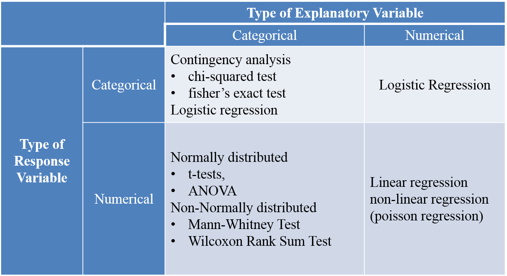

# Simple modeling

Patterns in the data provide clues about relationship or covariation.Now that we know how to visualize the various relationships, we can proceed to know more about how to formally test the relationship.

Statistical models are tools for extracting patterns out of data.

Statistics represent a common method of presenting information helping us to understand what the data are telling us.

 - *Descriptive (or summary) statistics* summarise the raw data and allow data users to interpret a dataset more easily.Descriptive statistics can describe the shape, centre and spread of a dataset.

 - *Inferential statistics* are used to infer conclusions about a population from a sample of that population. Inferential statistics are the result of techniques that use the data collected from a sample to make generalisations about the whole population from which the sample was taken. Inferential statistics include *estimation* (An estimate is a value that is inferred for a population based on data collected from a sample of units from that population), and *hypothesis testing*.
 
 
```{r stats, fig.cap='stats', out.width='100%', fig.asp=.75, fig.align='center'}



#source:from slides, Dr.Russell Thomson, Statistical Consultant, Centre for Research in Mathematics and Graduate Research School

```
## Two continuous/numerical variables

The techique we used here is called *Simpler linear regression*, where there is one dependent variable (continuous) and one independent variable (continuous). When there are more than one independent variable (continuous), you need to look for something called *Multiple linear regression*. 

```{r}

head(faithful)

ggplot(faithful)+
  geom_point(aes(eruptions, waiting))

```
Correlation: r
The technical term for the degree to which the data points cluster around the regression line is correlation. The correlation coefficient of a given population is denoted by ρ and that of a sample from that population by r. The correlation coefficient is bounded by -1 and +1. When the correlation is -1 or +1, all the data points lie exactly on the regression line and in that case the regression line is equal to the line Y=-X and Y=X respectively. You can regard r as a measure of how useful it is to fit a straight line to the data. If r is close to zero, the regression line does not help at all to predict where the data points will be for a give value of the predictor variable. Also, r tells us how much of the scatter we get a handle one. this is accounted for or explained, by r2 (often denoted by R2). R2 quantifies the proportion of the variance in the data that is captured and explained by the regression model.


