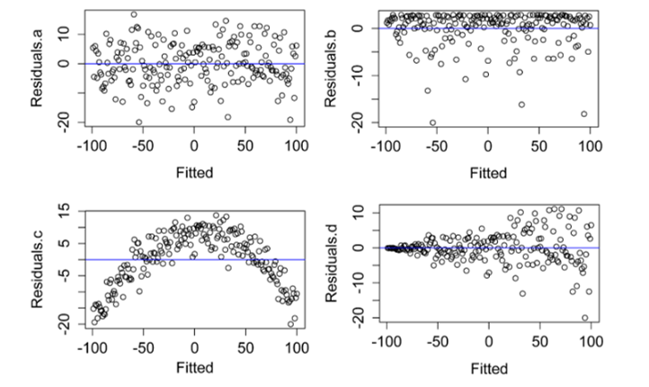

# Parametric tests and relevant assumptions

This section further illustrates assumptions of parametric tests and the methods to assess them. 
```{r echo=FALSE, include=FALSE}
if(!require(psych)){install.packages("psych")}
if(!require(rcompanion)){install.packages("rcompanion")}
if(!require(car)){install.packages("car")}
if(!require(lawstat)){install.packages("lawstat")}
library(psych)
library(rcompanion)
library(car)
library(lawstat)
```


## Parametric statistical tests

T-test, analysis of variance, and linear regression are all parametric statistical tests. They are used when the dependent variable is an *interval/ratio data variable*, such as length, height, weight.
 
Advantages:

 - your audience will likely be familiar with the techniques and interpretation of the results.
 
 - These tests are also often more flexible and more powerful than their nonparametric analogues.

Drawback:

 - all parametric tests assume something about the distribution of the underlying data.  If these assumptions are violated, the resultant test statistics will not be valid, and the tests will not be as powerful as for cases when assumptions are met.
 
 - Count/categorical data may not be appropriate for common parametric tests.   
 
## Assumptions

### Random sampling

The data captured in the sample are randomly chosen from the population as a whole.  Selection bias will obviously affect the validity of the outcome of the analysis.

### Independent observations

Tests will also assume that observations are independent of one another, except when the analysis takes non-independence into account.  

For example, in repeated measures experiments, the same subject is observed over time. Students with a high test score on one date to have a high test score on subsequent dates.  In this case the observation on one date would not be independent of observations on other dates.The independence of observation is often assumed from good experimental design.  Also, data or residuals can be plotted, for example to see if observations from one date are correlated to those for another date.

### Normal distribution of data or residuals

Parametric tests assume that the data come from a population of known distribution, such as normal distribution. That is, the data are normally distributed once the effects of the variables in the model are taken into account.  

Practically speaking, this means that the residuals from the analysis should be normally distributed.  This will usually be assessed with a histogram of residuals, a density plot, or with quantile–quantile plot.

A select number of tests (limited to one-sample t-test, two-sample t-test, and paired t-test) will require that data itself be normally distributed.For other tests, the distribution of the residuals will be investigated.

Residuals, also commonly called errors, are the difference between the observations and the value predicted by the model.  For example, if the calculated mean of a sample is 10, and one observation is 12, the residual for this observation is 2.
Be careful not to get confused about this assumption.  You may see discussion about how “data” should be normally distributed for parametric tests.  This is usually wrong-headed.  The t-test assumes that the observations for each group are normally distributed, but if there is a difference in the groups, we might expect a bi-modal distribution, not a simple normal distribution, for the combined data.  This is why in most cases we look at the distribution of the residuals, not the raw data.

### Homogeneity of variance 
Parametric analyses will also assume a homogeneity of variance among groups.  That is, for Student's t-test comparing two groups, each group should have the same variance.Homogeneity of variance is also called homoscedasticity.

### Additivity of treatment effects

Models for two-way analysis of variance and similar analyses are constructed as linear models in which the dependent variable is predicted as a linear combination of the independent variables.

A violation of this assumption is sometimes indicated when a plot of residuals versus predicted values exhibits a curved pattern.

### Outliers
Outliers are observations whose value is far outside what is expected.  They can play havoc with parametric analyses since they affect the distribution of the data and strongly influence the mean.

There are a variety of formal tests for detecting outliers, but they will not be discussed here.  The best approach is one that looks at residuals after an analysis.  Good tools are the “Residuals vs. leverage” plot and other plots in the “Other diagnostic plots” section below.

> Some parametric tests are somewhat robust to violations of certain assumptions.  For example, the t-test is reasonably robust to violations of normality for symmetric distributions, but not to samples having unequal variances (unless Welch's t-test is used).  A one-way analysis of variance is likewise reasonably robust to violations in normality.

> ...model assumptions should always be checked, but you may be able to tolerate small violations in the distribution of residuals or homoscedasticity.  Large violations will make the test invalid, though.  It is important to be honest with your assessments when checking model assumptions.  It is better to transform data, change your model, use a robust method, or use a nonparametric test than to not have confidence in your analysis. 

## Assessing model assumptions

### normality of residuals
There are formal tests to assess the normality of residuals.  

Common tests include 

- Shapiro-Wilk

- Anderson–Darling 

- Kolmogorov–Smirnov

- D’Agostino–Pearson 

However, their results are dependent on sample size.  When the sample size is large, the tests may indicate a statistically significant departure from normality, even if that departure is small.  And when sample sizes are small, they won’t detect departures from normality.

In each case, the null hypothesis is that the data distribution is not different from normal.  That is, a significant p-value (p < 0.05) suggests that data are not normally distributed.


```{r}
library(tidyverse)
# head(diamonds)

# summary(diamonds)

test_data = diamonds%>%
  filter(cut %in% c("Fair", "Ideal" ),
         carat == 0.7,
         color %in% c("G", "F" ),
         clarity %in% c("SI1", "VS2" ))

# table(test_data$cut)

ggplot(test_data,
       aes(price, fill = cut)) +
       geom_density(position="dodge",
                    alpha = 0.6)

#Define a linear model

model = lm(price ~ cut + color,
           data = test_data)

 
#Shapiro–Wilk normality test
 

x = residuals(model)

shapiro.test(x)


# Anderson-Darling normality test
 

if(!require(nortest)){install.packages("nortest")}

library(nortest)

x = residuals(model)

ad.test(x)


# One-sample Kolmogorov-Smirnov test
 

x = residuals(model)

ks.test(x,
        "pnorm",
        mean = mean(x),
        sd   = sd(x))

# D'Agostino Normality Test
 

if(!require(fBasics)){install.packages("fBasics")}

library(fBasics)

x = residuals(model)

dagoTest(x)


```
### Skew and kurtosis
There are no definitive guidelines as to what range of skew or kurtosis are acceptable for considering residuals to be normally distributed. we can rely on skew and kurtosis calculations,or histograms and other plots.

If the absolute value is > 0.5, BE CAUTIOUS 
If the absolute value is > 1.0, consider it not normally distributed. 
Some authors use 2.0 as a cutoff for normality, and others use a higher limit for kurtosis.

```{r}
# library(psych)

x = residuals(model)

describe(x,
         type=2)    
```

### Visual inspection to assess the normality of residuals

Usually, the best method to see if model residuals meet the assumptions of normal distribution and homoscedasticity are to plot them and inspect the plots visually.

#### Histogram with normal curve

A histogram of the residuals should be approximately normal, without excessive skew or kurtosis.  

Adding a normal curve with the same mean and standard deviation as the data helps to assess the histogram.

```{r}
x = residuals(model)

library(rcompanion)


plotNormalHistogram(residuals(model))   
```

#### Kernel density plot with normal curve
A kernel density plot is similar to a histogram, but is smoothed into a curve.  Sometimes a density plot gives a better representation of the distribution of data, because the appearance of the histogram depends upon how many bins are used. 

The plotNormalDensity function will produce this plot.  Options include those for the plot function, as well as adjust, bw, and kernel which are passed to the density function.  col1, col2, and col3 change plot colors, and lwd changes line thickness.
```{r}
library(rcompanion)

x = residuals(model)

plotNormalDensity(x,
                  adjust = 1)  ### Decrease this number
                                 ###  to make line less smooth
```
### Visual inspection for homogeneity of variance
Patterns in the plot of residuals versus fitted values can indicate a lack of homoscedasticity or that errors are not independent of fitted values.

```{r}
plot(fitted(model),
     residuals(model))
```
In the four plots below, A) Residuals.a show normally distributed and homoscedastic residuals, suggesting model assumptions were met.  B) Residuals.b show a non-normal distribution of residuals.  C)  Residuals.c show that the residuals are not independent of the fitted values.  In this case, the model needs to be modified in order to describe the data well.  D) Residuals.d show heteroscedasticity, since variability in the residuals is greater for large fitted values than for small fitted values.  (Adapted from similar plots in Tabachnick, 2001).
```{r residual plot, fig.cap='residual plot', out.width='100%', fig.asp=1, fig.align='center', echo=FALSE}




```

### formal tests for homogeneity of variance

In each case, the null hypothesis is that the variance among groups is not different.  That is, a significant p-value (p < 0.05) suggests that the variance among groups is different.

```{r}
#Define a linear model

model = lm(price ~ cut + color,
           data = test_data)
```
#### Bartlett’s test for homogeneity of variance

Bartlett’s test is known to be sensitive to non-normality in samples.  That is, non-normal samples can result in a significant test due to the non-normality.
```{r}
x = residuals(model)

bartlett.test(x ~ interaction(cut, color),
              data = test_data)
```
#### Levene’s test for homogeneity of variance
Levene’s test is an alternative to Bartlett’s that is supposedly less sensitive to departures from normality in the data.

```{r}
#library(car)

x = residuals(model)

leveneTest(x ~ cut * color,
            data=test_data,
            center=mean)       ### original Levene’s test
```

#### Brown–Forsythe or robust Levene’s test

The Brown–Forsythe modification of Levene’s test makes it more robust to departures in normality of the data.
```{r}
x = residuals(model)

#library(car)
leveneTest(x ~ cut * color, data=test_data)


#library(lawstat)
levene.test(x, interaction(test_data$cut, test_data$color))
```

#### Fligner-Killeen test

The Fligner-Killeen test is another test for homogeneity of variances that is robust to departures in normality of the data.

```{r}

x = residuals(model)

fligner.test(x ~ interaction(cut, color), data=test_data)


```

References:
https://rcompanion.org/handbook/I_01.html

