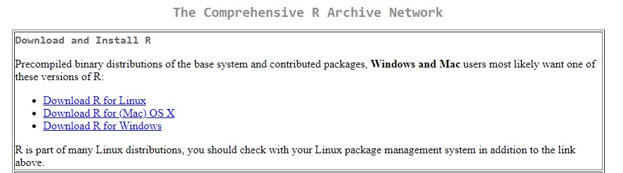

--- 
title: "A Introduction to Eploratory Data Analysis with R"
author: "Juqiang Chen"
date: "`r Sys.Date()`"
site: bookdown::bookdown_site
output: bookdown::gitbook
documentclass: book
bibliography: [book.bib, packages.bib]
biblio-style: apalike
link-citations: yes
github-repo: rstudio/bookdown-demo
description: "This is an introduction to Eploratory Data Analysis with R tutorial for DH summer school 2019 at Newcastle."
---


# Prerequisites

This document is to accompany **Eploratory Data Analysis with R** tutorial for DH Downunder 2019 at the University of Newcastle, Australia, from 9-13 December.

I am a speech scientist working on cross-language lexical tone perception and production. I have rich experience dealing with experimental data and I am keen to help others with data wrangling, data visualization and statistical modelling problems. I aspire to promote a streamlined workflow with R packages to improve data analysis efficiency in quantitative analysis in the field of social science and linguistics.

If you have any questions about the tutorial, please e-mail me at:
<j.chen2@westernsydney.edu.au>

This workshop will show how to use data transformation and visualization to explore your data in a systematic way, or in a statistical term, exploratory data analysis. Participants will learn to generate questions about the data, search for answers by transforming, visualizing and modeling the dataset, and use what they learn to further refine the questions and/or generate new questions. The workshop will start by exploring variations in (categorical and continuous) one variable and move on to investigate covariations among two or three variables. Participants will learn to produce summary tables (calculating mean or standard deviation etc. of one or multiple variables by one or more variables) and will also learn to draw figures with ggplot2. This workshop builds on some knowledge of data wrangling. Therefore, it is desirable that participants should take the Introduction to data wrangling with R, if they have no such knowledge. Participants are welcomed to bring their own data and apply what they learn on the spot.

Before we start our journey of data wrangling with R, you will need to install R on your laptop. R is multi-platform, which means you can install R on your PC or MAC.


## Installing R and R studio

Use this link [https://cloud.r-project.org/] to download R and select the proper version for your laptop.
```{r nice-fig, fig.cap='Download R', out.width='100%', fig.asp=.75, fig.align='center'}



```

## Installing libraries in R

RStudio is an integrated development environment, or IDE, for R
programming. Download and install it from [http://www.rstudio.com/download.]

The free version is poweful enough.

## Install packages and library packages

 * install.packages("package_name")

 * library(package_name)
 
## Programme

**Session 1** chapter 1 & 2

**Session 2** chapter 3, 4 & 5

**Session 3** chapter 3, 4 & 5
